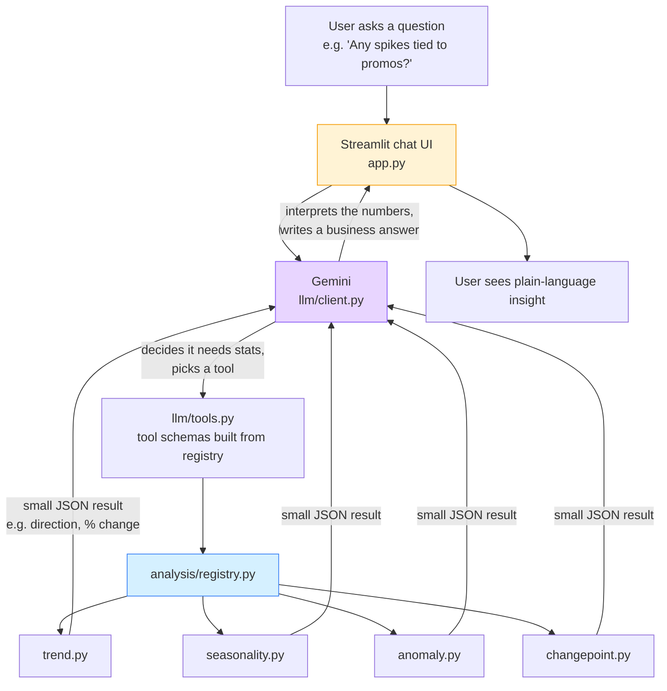

# Time Series Insight Bot

A chatbot that reasons about a time series by calling deterministic
statistics functions as tools, rather than asking the LLM to do math
on raw numbers.

## How it works



The key idea: the LLM never sees the raw 365-row time series and never
does arithmetic itself. It only sees small structured JSON summaries
produced by real statistics code, and its only job is to *interpret*
those numbers for a business audience - not calculate them. This is
also why it can't easily hallucinate a growth rate or an outlier that
doesn't exist: the numbers come from `analysis/`, not from the model.

## Why it's built this way

LLMs are unreliable at arithmetic over long sequences and prone to
hallucinating numbers. So the LLM never sees the raw 365-row series -
it only sees small structured JSON summaries produced by real code,
and its job is to *interpret* those numbers for a business audience,
not calculate them.

## Structure

```
data/
  generate_data.py   -> makes a synthetic sales.csv (trend + seasonality + anomalies)
  sales.csv          -> generated dataset

analysis/            -> one file per algorithm, all with the same shape:
  trend.py               def analyze(df, value_col) -> dict
  seasonality.py
  anomaly.py
  changepoint.py
  registry.py         -> the ONLY file that wires modules into the app

llm/
  tools.py           -> auto-builds Gemini tool schemas from the registry
  client.py          -> the tool-use conversation loop (the only file that calls the API)

app.py               -> single-page Streamlit chat UI
```

## Swapping an algorithm

Say you want a better anomaly detector (e.g. IsolationForest instead of
z-score). You only touch `analysis/anomaly.py` - keep the function
signature `analyze(df, value_col) -> dict` and the same return keys, and
nothing else in the app needs to change. The registry, the tool schema,
and the Streamlit UI are all decoupled from the implementation.

To add a completely new kind of analysis (say, correlation with an
external column), write a new module with an `analyze()` function and
add one line to `analysis/registry.py`. The LLM automatically gets a new
tool it can call.

## Running it

```bash
pip install -r requirements.txt
python data/generate_data.py        # generates data/sales.csv
export GEMINI_API_KEY=...
streamlit run app.py
```

## Talking points for an interview

- **Separation of concerns**: statistics layer, LLM layer, and UI are
  three independent files/folders that don't leak into each other.
- **LLM as reasoning layer, not calculator**: the model only ever sees
  pre-computed structured summaries, never raw numeric arrays.
- **Tool use / function calling**: the chatbot decides *which* analysis
  it needs per question, rather than being handed everything up front.
- **Extensibility**: swapping or adding an algorithm is a one-file (or
  one-line) change, which matters a lot if this were a real product
  with evolving requirements.
- **Evaluation**: because the sample dataset is synthetic with known
  injected facts (which days had promos, which spike was unexplained,
  that weekends dip), `eval/` can check the bot's answers against
  ground truth instead of eyeballing it - see below.

## Evaluating the bot

The sample dataset isn't just random noise - `data/generate_data.py`
injects specific known facts (promo-driven spikes on known dates, one
deliberately *unexplained* spike, a real weekly seasonality pattern).
Because we know the ground truth, `eval/run_eval.py` can automatically
check whether the bot:

1. **Grounding** - actually calls the right analysis tool for each
   question, instead of guessing from training data.
2. **Content** - states facts that match what's actually in the data
   (e.g. correctly attributes promo spikes to the promo dates, and -
   the interesting case - does NOT confidently invent a cause for the
   spike that has no promo flag).

```bash
python eval/run_eval.py
```

This writes a pass/fail report to the console and a full transcript
to `eval/results.json`. Add new cases by adding an entry to
`eval/cases.py` - no changes needed elsewhere.